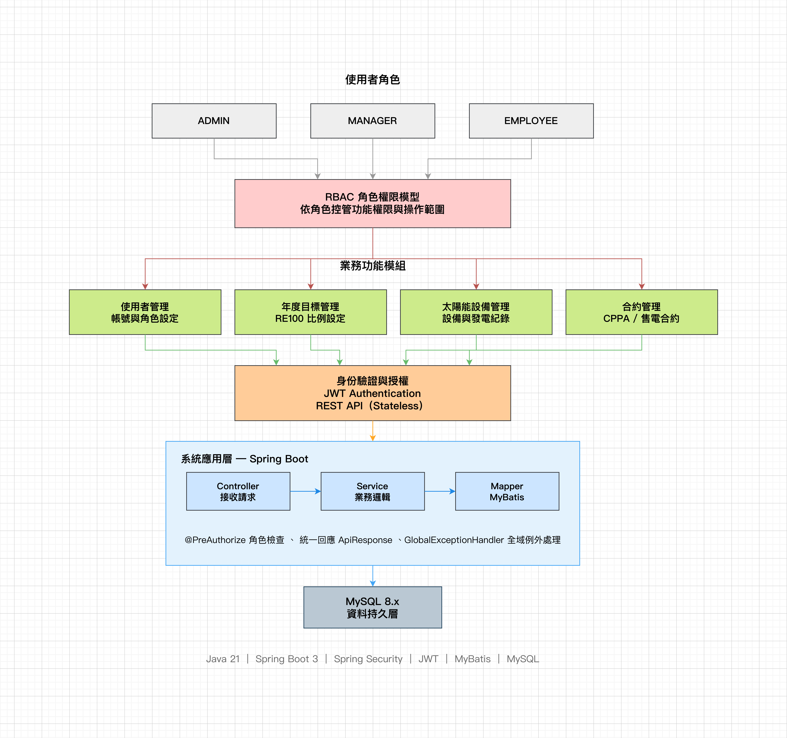

# Green Energy Platform（GEP）

> 綠電管理平台後端系統。模擬企業導入綠電管理流程的情境，整合年度目標管理、太陽能設備管理、綠電合約管理及使用者權限控管等核心功能。

系統採用 RBAC（Role-Based Access Control）模型，透過角色分工實現資料維護、審核管理與查詢作業，建立一套支援多角色協作的企業內部管理平台。

## 線上展示

[Demo 網站](https://yenkemiel.github.io/gep-frontend/login.html) ｜ [Swagger API 文件](https://green-energy-platform-production.up.railway.app/swagger-ui/index.html) ｜ [前端 Repository](https://github.com/yenkemiel/gep-frontend)

> 展示帳號（登入頁提供快速登入按鈕）
> | 角色 | 帳號 | 密碼 |
> |---|---|---|
> | ADMIN | admin | admin123 |
> | MANAGER | manager01 | newpassword123 |
> | EMPLOYEE | employee01 | Employee@123 |

## 專案背景

台灣中小企業在推動 RE100 與 ESG 永續目標時，綠電相關資料（太陽能發電量、購電合約、年度目標）多分散於 Excel 與紙本記錄，缺乏統一管理工具。本專案模擬企業內部綠電管理流程，建立一套支援多角色協作、權限分級控管的 B2B 工作流系統。

## 系統架構



使用者依角色（ADMIN / MANAGER / EMPLOYEE）透過 RBAC 權限模型存取對應的業務模組，前端發出的請求經由 JWT 驗證後，由 Spring Boot 三層架構（Controller → Service → Mapper）處理業務邏輯，最終存取 MySQL 資料庫。

## 核心功能

### 使用者管理
帳號建立、角色指派、啟用 / 停用、密碼重設。所有帳號僅由 ADMIN 建立，不開放自行註冊。

### 年度目標管理
設定企業年度用電量與 RE100 目標比例，系統自動計算當年所需綠電量。

### 太陽能設備管理
設備建檔（容量、安裝日期、地點）、月發電紀錄登錄，系統依設備容量自動計算理論發電量作為對照基準。

### 合約管理
綠電採購合約建立與管理，支援 CPPA 長期供電合約與向售電業購買兩種類型，合約到期自動轉為失效狀態，MANAGER 可手動提前終止。

## 角色與權限

系統依「資料輸入」與「審核 / 設定」分工，同一模組內不同操作對應不同角色：

| 模組 | 操作 | ADMIN | MANAGER | EMPLOYEE |
|---|---|:---:|:---:|:---:|
| 使用者管理 | 全部操作 | ✓ | ✗ | ✗ |
| 年度目標管理 | 查詢／建立／修改／刪除 | ✗ | ✓ | ✗ |
| 太陽能設備管理 | 查詢 | ✗ | ✓ | ✓ |
| 太陽能設備管理 | 新增設備／修改狀態／登錄發電紀錄 | ✗ | ✗ | ✓ |
| 合約管理 | 查詢 | ✗ | ✓ | ✓ |
| 合約管理 | 建立／修改 | ✗ | ✗ | ✓ |
| 合約管理 | 終止 | ✗ | ✓ | ✗ |

權限控管透過 `@PreAuthorize` 註解於每支 API 端點實作，搭配 JWT Token 內的角色資訊進行驗證。


## 系統設計與技術實作
### 開發與部署

| 類別 | 技術 |
|--------|--------|
| Language | Java 21 |
| Framework | Spring Boot 3.4.5 |
| Security | Spring Security、JWT |
| ORM | MyBatis |
| Database | MySQL 8 |
| API Docs | Swagger(OpenAPI) |
| Build Tool | Maven |
| Container | Docker |
| Deployment | Railway |
### Security
- Spring Security
- JWT Authentication（無狀態驗證）
- RBAC 角色權限控管（`@PreAuthorize`）

### API Layer
- RESTful API
- Swagger（OpenAPI）自動化文件

### Business Layer
- Service Pattern（業務邏輯封裝）
- DTO 參數驗證（`@Valid`）

### Persistence Layer
- MyBatis（原生 XML，非 MyBatis-Plus）
- MySQL 8.x
- PageHelper 分頁

### Exception Handling
- `GlobalExceptionHandler` 全域例外處理
- `ApiResponse` 統一回應格式
- 自訂 `BusinessException` 搭配明確錯誤代碼


## API 設計

統一回應格式 `ApiResponse`，全域例外處理 `GlobalExceptionHandler` 搭配自訂 `BusinessException`，所有錯誤回應附帶明確的錯誤代碼。完整 API 規格與測試介面請見 [Swagger UI](https://green-energy-platform-production.up.railway.app/swagger-ui/index.html)。

範例端點：

```
POST   /api/v1/auth/login                              使用者登入
GET    /api/v1/solar-devices                            查詢太陽能設備清單
POST   /api/v1/solar-devices/{id}/monthly-records       新增月發電紀錄
GET    /api/v1/contracts                                 查詢合約清單
POST   /api/v1/contracts/{id}/terminate                 終止合約
```

## 專案結構

```
green-energy-platform/
├── docs/images/              # 系統架構圖
├── src/main/java/com/kemiel/greenenergy/
│   ├── common/                # ApiResponse、例外處理、Enum、工具類
│   ├── config/                # Security、JWT、CORS、Swagger 設定
│   ├── module/
│   │   ├── auth/                # 登入驗證
│   │   ├── user/                # 使用者管理
│   │   ├── target/              # 年度目標管理
│   │   ├── solar/                # 太陽能設備管理
│   │   └── contract/            # 合約管理
│   └── GreenEnergyPlatformApplication.java
├── src/main/resources/
│   ├── mapper/                  # MyBatis XML
│   └── db/                      # init.sql、seed.sql
└── pom.xml
```

三層架構：Controller 接收請求 → Service 處理業務邏輯 → Mapper 執行 SQL。

## 本機啟動

### 環境需求
- JDK 21
- Maven
- MySQL 8.x（或使用 Docker）

### 啟動步驟

```bash
# 1. 啟動本機 MySQL，建立資料庫
mysql -u root -p < src/main/resources/db/init.sql

# 2. 複製環境設定
cp .env.example .env
# 填入本機 DB 連線資訊與 JWT_SECRET

# 3. 啟動專案
./mvnw spring-boot:run -Dspring-boot.run.profiles=dev
```

> 本機開發環境使用 Docker 建置 MySQL 容器，正式環境部署至 Railway 雲端平台，兩者為獨立資料庫，互不影響。

### 確認啟動成功

```
Swagger UI： http://localhost:8080/swagger-ui/index.html
```

ADMIN 帳號於系統首次啟動時自動建立，初始密碼為 `admin123`。

## 未來規劃

- 規劃中的採購管理模組（六狀態機：草稿 → 送出 → 審核 → 處理中 → 完成 → 作廢）
- 每月用電量登記與月份鎖定機制
- 跨模組綠電來源彙整計算服務
- Audit Log 操作紀錄查詢
- RE100 達成率儀表板與缺口預測